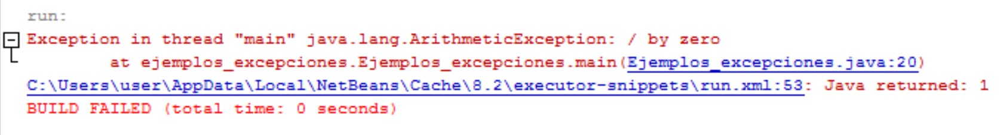
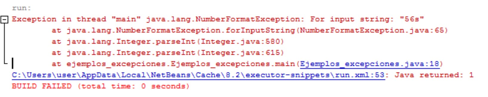
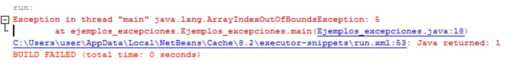

# 1. Introducció

**Una excepció és un error semàntic que es produeix en temps d'execució**. Encara que un codi siga correcte sintàcticament (és codi Java vàlid i pot compilar-se), és possible que durant la seua execució es produïsquen errors inesperats, com per exemple:

- Dividir per zero.
- Intentar accedir a una posició d'un array fora dels seus límits.
- Al cridar al `nextInt()` d'un `Scanner` l'usuari no introdueix un valor enter.
- Intentar accedir a un fitxer que no existeix o que està en un disc dur corrupte.
- Etc.

Quan això ocorre, la màquina virtual Java crea un objecte de la classe **`Exception`** (les excepcions en Java són objectes) i es notifica el fet al sistema d'execució. Es diu que s'ha llançat una excepció ("**Throwing Exception**"). Existeixen també els errors interns que són objectes de la classe **`Error`** que no estudiarem. Totes dues classes `Error` i `Exception` són classes derivades de la classe base **`Throwable`**.

Un mètode es diu que és capaç de tractar una excepció ("**Catch Exception**") si ha previst l'error que s'ha produït i les operacions a realitzar per a “recuperar" el programa d'aqueix estat d'error. No és suficient capturar l'excepció, si l'error no es tracta tan sols aconseguirem que el programa no es pare, però l'error pot provocar que les dades o l'execució no siguen correctes.

En el moment en què és llançada una excepció, la màquina virtual Java recorre la pila de cridades a mètodes a la recerca d'algun que siga capaç de tractar la classe d'excepció llançada. Per a això, comença examinant el mètode on s'ha produït l'excepció; si aquest mètode no és capaç de tractar-la, examina el mètode des del qual es va realitzar la cridada al mètode on es va produir l'excepció i així successivament fins a arribar a l'últim d'ells. En cas que cap dels mètodes de la pila siga capaç de tractar l'excepció, la màquina virtual Java mostra un missatge d'error i el programa acaba.

Els programes escrits en Java també poden llançar excepcions explícitament mitjançant la instrucció `throw`, la qual cosa facilita la devolució d'un "codi d'error" al mètode que va invocar el mètode que va causar l'error.

## 1.1. Exemple 1

Com a primera trobada amb les excepcions, executarem el següent programa. En ell forçarem una excepció en intentar dividir un número entre 0:

```java
public class Exemple1_excepcions{
    public static void main(String args[]){
        int div, x, y;
        x = 3;
        y = 0;

        div = x / y;

        System.out.println("El resultat és " + div);
    }
}
```
Sent l'eixida:



El que ha ocorregut és que la màquina virtual Java (el programa que executa codi Java) ha detectat una condició d'error, la divisió per 0, i ha creat un objecte de la classe <i>java.lang.ArithmeticException</i>. Com el mètode on s'ha produït l'excepció no és capaç de tractar-la, la màquina virtual Java finalitza el programa en la línia on realitza la divisió i mostra un missatge d'error amb la informació sobre l'excepció que s'ha produït.

## 1.2. Exemple 2

A continuació forçarem una excepció de conversió, per a això intentarem passar a enter una cadena que no sols porta caràcters numèrics:

```java
public class Exemple2_excepcions{
    public static void main(String args[]){
        String cadena = "56s";
        int num;

        num = Integer.parseInt(cadena);

        System.out.println("El número és " + num);
    }
}
```

Sent l'eixida:



Pel fet que la cadena no té el format adequat ("56s" no representa un número vàlid), el mètode Integer.parseInt(…) no pot convertir-la a un valor de tipus int i llança l'excepció <i>NumberFormatException</i>. La màquina virtual Java finalitza el programa en la línia on s'usa el parseInt() i mostra per pantalla la informació sobre l'excepció que s'ha produït.

## 1.3. Exemple 3

En aquest exemple forçarem una excepció de límits del vector, per a això crearem un vector i
intentar accedir a una posició que no existeix:

```java
public class Exemple3_excepcions{
    public static void main(String args[]){
        int v[] = {1,2,3};
        int elem;

        elem = v[5];

        System.out.println("L'element és " + elem);
    }
}
```

Sent l'eixida:



En intentar accedir a una posició que sobrepassa la grandària del vector es produeix una excepció de tipus <i>ArrayIndexOutOfBoundsException</i>. La màquina virtual de java finalitza el programa en la línia 18 i mostra el missatge d'error sobre l'excepció que s'ha produït.
