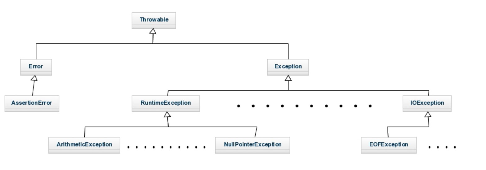

# 4. Jerarquia i tipus d'excepcions

La classe Exception hereta de Throwable, i alhora, totes las excepcions hereten de Exception.

Com java.lang és importat de forma implícita en tots els programes, la major part de les excepcions derivades de RuntimeException estan disponibles de manera automàtica. A més no és necessari incloure-les en cap capçalera de mètode mitjançant throws.

Les Excepcions poden ser comprovades i no comprovades:

- Excepcions comprovades: aquelles que Java comprova durant la compilació, abans de l'execució del programa.
- Excepcions no comprovades: aquelles que Java no pot comprovar durant la compilació i es produiran durant l'execució del programa.

| Excepció                     | Significat                                                                 |
|------------------------------|---------------------------------------------------------------------------|
| ClassNotFoundException       | No s'ha trobat la classe.                                                  |
| CloneNotSupportedException   | Intent de duplicat d'un objecte que no implementa la interfície Clonable.  |
| IllegalAccessException       | S'ha denegat l'accés a una classe.                                         |
| InstantiationException       | Intent de crear un objecte d'una classe abstracta o interfície.            |
| InterruptedException         | Fil interromput per un altre fil.                                          |
| NoSuchFieldException         | El camp sol·licitat no existeix.                                           |
| NoSuchMethodException        | El mètode sol·licitat no existeix.                                         |

Les subclasses de RuntimeException no comprovades són:

| Excepció | Significat |
|-----------|------------|
| AritmeticException | Error aritmètic com a divisió entre zero |
| ArrayIndexOutOfBoundsException | Índex de la matriu fora del seu límit |
| ArrayStoreException | Assignació a una matriu de tipus incompatible |
| ClassCastException | Conversió invalida |
| IllegalArgumentException | Ús invàlid d'un argument en cridar a un mètode |
| IllegalMonitorStateException | Operació de monitor invàlida, com esperar un fil no bloquejat |
| IllegalStateException | L'entorn o aplicació estan en un estat incorrecte |
| IllegalThreadStateException | L'operació sol·licitada és incompatible amb l'estat actual del fil |
| IndexOutOfBoundException | Algun tipus d'índex està fora del seu rang o del seu límit |
| NegativeArraySizeException | La matriu té una grandària negativa |
| NullPointerException | Ús incorrecte d'una referència NULL |
| NumberFormatException | Conversió incorrecta d'una cadena a un format numèric |
| SecurityException | Intent de violació de seguretat |
| StringIndexOutBounds | Intent de sobrepassar el límit d'una cadena |
| TypeNotPresentException | Tipus no trobat |
| UnsupportedOperationException | Operació no admesa |

És interessant conèixer els diferents tipus d'excepcions, però **no és necessari saber-li-les de memòria ni entendre exactament quan es produeix cadascuna**.

Encara que les excepcions que incorpora Java, gestionen la majoria dels errors més comuns, és probable que el programador preferisca crear els seus propis tipus d'excepcions per a gestionar situacions específiques de les seues aplicacions. Tan sols cal definir una subclasse de Exception, que naturalment és subclasse de Throwable.
